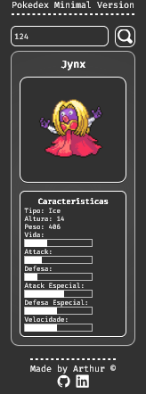

# TOOK-NOTES

EN:

### About the project

- A minimalist pokedex made with basic html, css and js, you can search for the pokemon with id or name in the search bar, if the name is not valid an alert will show in the screen, I want add an way to go fowards or backwards by simply clicking an button.
### How to execute the project:

1. Have an IDE that supports HTML, CSS, JavaScript and that can run the code on screen, like vscode with live server;
2. Clone this repository using `git clone https://github.com/arthurdev06/arthurdev06.github.io/tree/main/minimal-pokedex` command;

PT-BR:

<h3>Sobre</h3>

- Uma pokedex minimalista feita com css javascript básicos, que o usuário pode buscar pelo pokemon pelo id ou nome, sem mostrar todos os disponíveis, futuramente quero adicionar um modo de nevegar pelos pokemons aumentando ou diminuindo o id por meio de butões.

### Como executar o projeto:

1. Tenha uma IDE que suporte HTML, CSS, JavaScript e que consiga rodar o código atualizando na tela, no vscode temos a extensão do live server;
2. Dê um `git clone https://github.com/arthurdev06/arthurdev06.github.io/tree/main/minimal-pokedex`;

