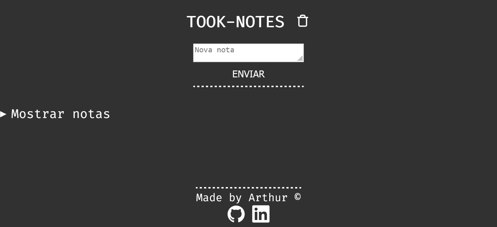

# TOOK-NOTES

EN:

### About the project

- A minimalist website made with basic html, css and js to put notes in, without any database and complex css, my initial idea was that the user could print the notes like an html ou markdown and not like an normal text but i didn't find an way to include this, this will be an future feature, but my code waits for the user's note content, then when the button "Send" is pressed it's created an details element at the bottom of the "Show notes" element, the user can't change the title because it's devided by date and time.(secret note: the details components fully works and a I don't know why)

### How to execute the project:

1. Have an IDE that supports HTML, CSS, JavaScript and that can run the code on screen, like vscode with live server;
2. Clone this repository using `git clone [https://github.com/arthurdev06/took-note](https://github.com/arthurdev06/arthurdev06.github.io/tree/main/took-notes)s` command;

PT-BR:

<h3>Sobre</h3>

- Um site minimalista feito com html, css e js para escrever anotações, sem banco de dados, sem muito css, minha ideia inicial era de ao invés as notas serem digitadas como texto normal seriam digitadas como html ou md, mas não encontrei um jeito de fazer a não se trocando o código base, mas meu código espera o usuário digitar o conteúdo da nota e clicar no botão de enviar que cria um details abaixo o details de mostrar anotações, não dá para mudar o título pois o título é definido automáticamente pela data e horário.
- O details de Mostrar notas está localizado a direita pois quero que as notas grandes fiquem de seu tamanho e não fiquem em colunas retas.(o componente details funciona completamente e não sei por que)

### Como executar o projeto:

1. Tenha uma IDE que suporte HTML, CSS, JavaScript e que consiga rodar o código atualizando na tela, no vscode temos a extensão do live server;
2. Dê um `git clone [https://github.com/arthurdev06/took-notes](https://github.com/arthurdev06/arthurdev06.github.io/tree/main/took-notes)https://github.com/arthurdev06/arthurdev06.github.io/tree/main/took-notes`;

